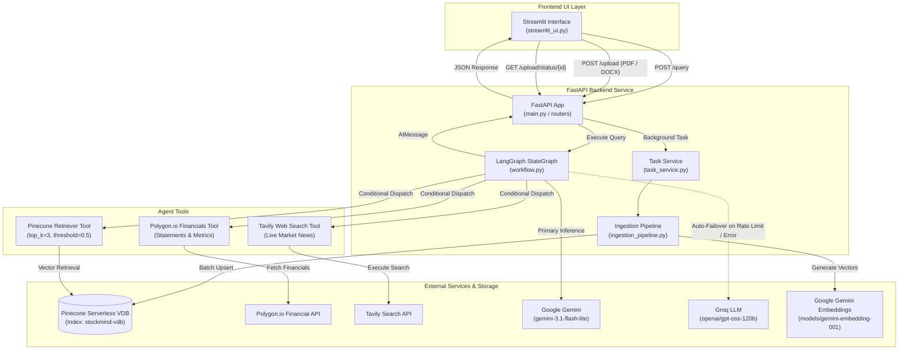

# StockMind

[](https://python.org)
[](https://fastapi.tiangolo.com)
[](https://streamlit.io)
[](https://langchain-ai.github.io/langgraph/)
[](https://ai.google.dev)
[](https://groq.com)
[](https://pinecone.io)
[](https://polygon.io)
[](https://tavily.com)
[](https://cloud.google.com/run)
[](https://docker.com)

StockMind is an agentic AI stock market research assistant that combines live market data, company financials, real-time web search, and custom document analysis into a conversational interface. Powered by a LangGraph state machine, it autonomously evaluates user queries and routes execution across RAG vector retrieval, structured financial statement APIs, and live web search.

---

## Table of Contents

- [Overview](#overview)
- [System Architecture](#system-architecture)
- [Key Features](#key-features)
- [Tech Stack](#tech-stack)
- [Repository Structure](#repository-structure)
- [Getting Started](#getting-started)
- [Configuration & Environment Variables](#configuration--environment-variables)
- [API Reference](#api-reference)
- [Google Cloud Run Deployment & CI/CD](#google-cloud-run-deployment--cicd)
- [License & Disclaimer](#license--disclaimer)
- [Author](#author)

---

## Overview

Retail investors, financial analysts, and researchers often spend hours manually cross-referencing SEC filings, earnings reports, and live market feeds across disjointed tools. StockMind unifies these data streams into an autonomous agent that dynamically invokes the optimal retrieval path:

- **RAG Document Retrieval**: Semantic vector search over user-uploaded filings, research papers, and trading reports (PDF, DOCX) indexed in Pinecone.
- **Structured Financial Statements**: Real-time balance sheets, income statements, and cash flow data via Polygon.io.
- **Live Market Intelligence**: Real-time macroeconomic news, sentiment, and trends retrieved via Tavily Search API.

---

## System Architecture



---

## Key Features

- **Autonomous Tool Routing**: LangGraph state machine evaluates query intent to conditionally execute RAG document retrieval, financial statement APIs, or live web search.
- **Resilient Dual-LLM Pipeline**: Primary generation using Google Gemini `gemini-3.1-flash-lite` with automatic failover to Groq (`openai/gpt-oss-120b`) during rate limits (429) or service disruptions.
- **Asynchronous Ingestion Pipeline**: Non-blocking document processing via FastAPI `BackgroundTasks` with batch chunking (40 chunks/batch), exponential backoff retries (up to 5 retries), and in-memory file buffering.
- **Real-Time Task Tracking**: Streamlit polling client displaying live vector indexing progress at batch-level granularity.
- **Streamlit Research Dashboard**: Custom-styled UI featuring session-persistent chat history, interactive starter prompt chips, and drag-and-drop document ingestion.
- **Structured Observability**: Dual file and stdout logging with standardized execution tracing via custom `StockMindException` handlers.

---

## Tech Stack

| Category | Technology | Details |
|---|---|---|
| **Runtime & Language** | Python 3.11 | Containerized execution environment via `python:3.11-slim` |
| **Backend Framework** | FastAPI | Async REST API backend served by Uvicorn and Gunicorn |
| **Frontend UI** | Streamlit | Responsive dashboard with custom 33KB stylesheet and theme |
| **Agent Orchestration** | LangGraph & LangChain | Compiled stateful `StateGraph` initialized during FastAPI lifespan |
| **Primary LLM** | Google Gemini | `gemini-3.1-flash-lite` via `langchain-google-genai` |
| **Fallback LLM** | Groq | `openai/gpt-oss-120b` via `langchain-groq` |
| **Embedding Model** | Google Gemini | `models/gemini-embedding-001` (3072 dimensions) |
| **Vector Store** | Pinecone | Serverless index (`stockmind-vdb`, Cosine metric, AWS `us-east-1`) |
| **External APIs** | Polygon.io & Tavily | Financial balance sheets and real-time live search ingestion |
| **Document Loaders** | PyPDF & Docx2txt | Chunking via `RecursiveCharacterTextSplitter` (size: 1000, overlap: 200) |
| **Deployment & CI/CD** | GCP Cloud Run & Docker | Multi-stage Docker builds deployed via GitHub Actions |

---

## Repository Structure

```
StockMind/
├── .env.example                    # Environment variable template
├── .github/
│   └── workflows/
│       └── deploy.yml              # CI/CD deployment to Google Cloud Run
├── docker-compose.yml              # Multi-container local orchestration
│
├── backend/
│   ├── Dockerfile                  # Multi-stage Python 3.11 backend build
│   ├── main.py                     # FastAPI application entry point + lifespan init
│   ├── requirements.txt            # Backend Python dependencies
│   ├── setup.py                    # Package metadata for editable installation
│   │
│   ├── agent/
│   │   └── workflow.py             # LangGraph StateGraph builder and tool binding
│   ├── config/
│   │   └── config.yaml             # Model configurations, retriever parameters, and tool limits
│   ├── data_ingestion/
│   │   └── ingestion_pipeline.py   # Document parsing, chunking, and Pinecone vector upsert
│   ├── data_models/
│   │   └── models.py               # Pydantic request and response schemas
│   ├── routers/
│   │   ├── chat_router.py          # Agentic query endpoint (/query)
│   │   └── ingestion_router.py     # Document upload and task polling endpoints
│   ├── services/
│   │   └── task_service.py         # Ingestion task management and state tracking
│   ├── toolkit/
│   │   └── tools.py                # LangChain tool interfaces (Retriever, Polygon, Tavily)
│   ├── prompt_library/
│   │   └── prompt.py               # System persona and response formatting prompts
│   ├── utils/
│   │   ├── config_loader.py        # Central YAML configuration loader
│   │   ├── model_loaders.py        # LLM and embedding factory instances
│   │   └── response_formatter.py   # Message response extraction utility
│   ├── custom_logging/
│   │   └── my_logger.py            # File and stdout logging handler
│   ├── exception/
│   │   └── exceptions.py           # Custom StockMindException definition
│   └── fallback_data/              # Sample financial documents (PDF, DOCX)
│
├── frontend/
│   ├── Dockerfile                  # Multi-stage Python 3.11 frontend build
│   ├── streamlit_ui.py             # Streamlit application entry point
│   ├── requirements.txt            # Frontend Python dependencies
│   ├── .streamlit/
│   │   └── config.toml             # Streamlit theme and server configuration
│   ├── components/
│   │   ├── chat.py                 # Chat interface with sample prompt chips
│   │   ├── sidebar.py              # File uploader and ingestion status monitor
│   │   ├── header.py               # Application header branding
│   │   ├── metrics.py              # Architecture capability cards
│   │   └── footer.py               # Author and social links
│   ├── utils/
│   │   └── assets.py               # Asset loader and CSS injector
│   ├── static/
│   │   └── css/
│   │       └── theme.css           # Custom CSS stylesheet
│   └── assets/                     # Platform and integration SVG icons
│
├── notebook/
│   └── experiments.ipynb           # R&D prototyping notebook
└── logs/                           # Runtime log output directory
```

---

## Getting Started

### Prerequisites

- **Python**: `3.11+`
- **Docker & Docker Compose**: Compose V2 compatible (for containerized runs)
- **API Keys**:
  - Google Gemini API Key ([Google AI Studio](https://aistudio.google.com/app/apikey))
  - Groq API Key ([Groq Console](https://console.groq.com/))
  - Pinecone API Key ([Pinecone Console](https://app.pinecone.io/))
  - Tavily API Key ([Tavily Console](https://tavily.com/))
  - Polygon.io API Key ([Polygon.io](https://polygon.io/))

---

### Method 1: Using Docker Compose (Recommended)

1. **Clone the repository:**
   ```bash
   git clone [https://github.com/Areeb-Ahmd/StockMind.git](https://github.com/Areeb-Ahmd/StockMind.git)
   cd StockMind
   ```

2. **Configure environment variables:**
   ```bash
   cp .env.example .env
   ```
   Fill in your API keys in `.env`:
   ```env
   GOOGLE_API_KEY="your-google-gemini-api-key"
   GROQ_API_KEY="your-groq-api-key"
   PINECONE_API_KEY="your-pinecone-api-key"
   TAVILY_API_KEY="your-tavily-api-key"
   POLYGON_API_KEY="your-polygon-api-key"
   ```

3. **Build and launch containers:**
   ```bash
   docker compose up --build -d
   ```

4. **Access the applications:**
   - **Frontend UI (Streamlit)**: [http://localhost:8501](http://localhost:8501)
   - **Backend API (FastAPI)**: [http://localhost:8000](http://localhost:8000)
   - **API Healthcheck**: [http://localhost:8000/health](http://localhost:8000/health)

---

### Method 2: Manual Local Setup (Without Docker)

1. **Clone the repository and set up virtual environment:**
   ```bash
   git clone [https://github.com/Areeb-Ahmd/StockMind.git](https://github.com/Areeb-Ahmd/StockMind.git)
   cd StockMind

   python -m venv venv
   # Linux / macOS:
   source venv/bin/activate
   # Windows:
   venv\Scripts\activate
   ```

2. **Install dependencies:**
   ```bash
   pip install -r backend/requirements.txt
   pip install -r frontend/requirements.txt
   pip install -e backend/
   ```

3. **Configure environment variables:**
   ```bash
   cp .env.example .env
   ```

4. **Start the backend server (Terminal 1):**
   ```bash
   cd backend
   uvicorn main:app --host 0.0.0.0 --port 8080 --reload
   ```

5. **Start the frontend application (Terminal 2):**
   ```bash
   cd frontend
   set BACKEND_URL=http://localhost:8080
   streamlit run streamlit_ui.py --server.port 8501
   ```

---

## Configuration & Environment Variables

### Environment Variables (`.env`)

| Variable | Required | Description | Sample Value |
|---|---|---|---|
| `GOOGLE_API_KEY` | Yes | Google Gemini API key for primary LLM inference and embeddings | `AIzaSyB-xxxxxxxxxxxxxxxxxxxx` |
| `GROQ_API_KEY` | Yes | Groq API key for fallback LLM inference | `gsk_xxxxxxxxxxxxxxxxxxxxxxxx` |
| `PINECONE_API_KEY` | Yes | Pinecone vector database API key | `pcsk_xxxxxxxxxxxxxxxxxxxxxxxx` |
| `TAVILY_API_KEY` | Yes | Tavily live web search API key | `tvly-xxxxxxxxxxxxxxxxxxxxxxxx` |
| `POLYGON_API_KEY` | Yes | Polygon.io financial data API key | `pk_xxxxxxxxxxxxxxxxxxxxxxxx` |
| `PORT` | Optional | Backend server listen port (Default: `8080`) | `8080` |
| `BACKEND_URL` | Optional | Backend URL consumed by frontend (Default: `http://localhost:8080`) | `http://localhost:8080` |

### System Configuration (`backend/config/config.yaml`)

| Parameter | Configuration Key | Default Value | Description |
|---|---|---|---|
| **Vector DB Index** | `vector_db.index_name` | `stockmind-vdb` | Pinecone vector index target |
| **Ingestion Batch Size** | `ingestion.batch_size` | `40` | Chunks processed per vector upsert batch |
| **Batch Delay** | `ingestion.delay_between_batches` | `5.0` | Delay between consecutive batches in seconds |
| **Max Ingestion Retries** | `ingestion.max_retries` | `5` | Maximum retries on embedding rate limits |
| **Retry Initial Delay** | `ingestion.retry_initial_delay` | `10.0` | Base exponential backoff delay in seconds |
| **Retriever Top K** | `retriever.top_k` | `3` | Number of document chunks retrieved |
| **Score Threshold** | `retriever.score_threshold` | `0.5` | Minimum cosine similarity threshold |
| **Primary Model** | `llm.primary.model_name` | `gemini-3.1-flash-lite` | Primary LLM model identifier |
| **Fallback Model** | `llm.fallback.model_name` | `openai/gpt-oss-120b` | Failover LLM identifier (via Groq) |
| **Embedding Model** | `embedding_model.model_name` | `models/gemini-embedding-001` | Embedding model identifier |
| **Tavily Max Results** | `tools.tavily.max_results` | `5` | Maximum web search results returned |

---

## API Reference

| Method | Endpoint | Description | Status Code |
|---|---|---|---|
| `GET` | `/` | Root service identification and operational status | `200 OK` |
| `GET` | `/health` | Application health check for Docker and Cloud Run probes | `200 OK` |
| `POST` | `/query` | Submit natural-language financial questions to the LangGraph agent | `200 OK` |
| `POST` | `/upload` | Upload PDF or DOCX files for asynchronous background ingestion | `202 Accepted` |
| `GET` | `/upload/status/{task_id}` | Poll real-time progress for a document ingestion task | `200 OK` |

### Request & Response Schemas

#### Query Execution (`POST /query`)
```json
// Request
{
  "question": "What are Apple's latest quarterly revenue figures?"
}
```

```json
// Response
{
  "answer": "## Apple Revenue Analysis\n..."
}
```

#### Document Upload (`POST /upload`)
```json
// Response (HTTP 202 Accepted)
{
  "task_id": "a1b2c3d4-xxxx-xxxx-xxxx-xxxxxxxxxxxx",
  "status": "processing",
  "current_batch": 0,
  "total_batches": 0,
  "message": "Upload received, starting ingestion background task...",
  "error": null
}
```

#### Ingestion Task Status (`GET /upload/status/{task_id}`)
```json
// Response (In Progress)
{
  "task_id": "a1b2c3d4-xxxx-xxxx-xxxx-xxxxxxxxxxxx",
  "status": "processing",
  "current_batch": 2,
  "total_batches": 5,
  "message": "Ingesting batch 2/5 (40 chunks)...",
  "error": null
}
```

---

## Google Cloud Run Deployment & CI/CD

StockMind includes an automated **GitHub Actions** deployment pipeline (`.github/workflows/deploy.yml`) that compiles multi-stage container builds, pushes them to **Google Artifact Registry**, and deploys them to **Google Cloud Run** on every commit to `main`.

### Initial GCP Setup via `gcloud` CLI

1. **Enable Google Cloud APIs:**
   ```bash
   gcloud services enable run.googleapis.com artifactregistry.googleapis.com secretmanager.googleapis.com
   ```

2. **Create Artifact Registry Repository:**
   ```bash
   gcloud artifacts repositories create stockmind-repo \
     --repository-format=docker \
     --location=asia-south1 \
     --description="StockMind container image repository"
   ```

3. **Store Secrets in GCP Secret Manager:**
   ```bash
   echo YOUR_GOOGLE_API_KEY | gcloud secrets create GOOGLE_API_KEY --data-file=- --replication-policy=automatic
   echo YOUR_GROQ_API_KEY | gcloud secrets create GROQ_API_KEY --data-file=- --replication-policy=automatic
   echo YOUR_PINECONE_API_KEY | gcloud secrets create PINECONE_API_KEY --data-file=- --replication-policy=automatic
   echo YOUR_TAVILY_API_KEY | gcloud secrets create TAVILY_API_KEY --data-file=- --replication-policy=automatic
   echo YOUR_POLYGON_API_KEY | gcloud secrets create POLYGON_API_KEY --data-file=- --replication-policy=automatic
   ```

4. **Configure GitHub Repository Secrets:**
   In your repository, navigate to **Settings → Secrets and variables → Actions** and add:
   - `GCP_PROJECT_ID`: Your GCP project ID
   - `GCP_REGION`: Target region (e.g., `asia-south1`)
   - `GCP_SA_KEY`: Service Account JSON credentials with Cloud Run Admin, Artifact Registry Writer, and Secret Manager Accessor roles
   - `GOOGLE_API_KEY`, `GROQ_API_KEY`, `PINECONE_API_KEY`, `TAVILY_API_KEY`, `POLYGON_API_KEY`

### Cloud Run Resource Allocation

| Service | CPU | Memory | Min Instances | Max Instances |
|---|---|---|---|---|
| **Backend API** | 1 vCPU | 1 GiB | 0 (Scale to zero) | 3 |
| **Frontend UI** | 1 vCPU | 512 MiB | 0 (Scale to zero) | 2 |

---

## License & Disclaimer

This software is for **educational and research purposes only**. Information provided by StockMind does not constitute financial advice, investment recommendations, or official endorsements.

---

## Author

- **Syed Areeb Ahmad** ([ahmad.syedareeb7@gmail.com](mailto:ahmad.syedareeb7@gmail.com))
- **GitHub**: [@Areeb-Ahmd](https://github.com/Areeb-Ahmd)
- **LinkedIn**: [areeb-ahmad7](https://www.linkedin.com/in/areeb-ahmad7)
